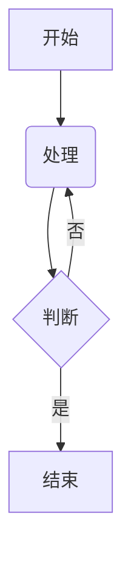

# Areas_Of_Knowledge\Frameworks_And_Tools\Markdown\Markdown_Cheatsheet.md

# Markdown 语法速查表

本文档在您提供的速查表基础上进行了补充和优化，旨在提供一个更全面、更易于查阅的 Markdown 语法指南。包含了基础语法、扩展语法以及一些高级用法，并为每个语法点提供了清晰的示例。

## 目录

- [Areas\_Of\_Knowledge\\Frameworks\_And\_Tools\\Markdown\\Markdown\_Cheatsheet.md](#areas_of_knowledgeframeworks_and_toolsmarkdownmarkdown_cheatsheetmd)
- [Markdown 语法速查表](#markdown-语法速查表)
  - [目录](#目录)
  - [一、基础语法](#一基础语法)
    - [1.1 标题](#11-标题)
    - [1.2 文本样式](#12-文本样式)
    - [1.3 列表](#13-列表)
    - [1.4 引用](#14-引用)
    - [1.5 链接](#15-链接)
    - [1.6 图片](#16-图片)
    - [1.7 代码](#17-代码)
    - [1.8 分隔线](#18-分隔线)
  - [**渲染效果**](#渲染效果)
    - [1.9 转义字符](#19-转义字符)
  - [二、扩展语法](#二扩展语法)
    - [2.1 表格](#21-表格)
    - [2.2 代码块](#22-代码块)
    - [2.3 删除线](#23-删除线)
    - [2.4 任务列表](#24-任务列表)
    - [2.5 脚注](#25-脚注)
    - [2.6 标题 ID（锚点）](#26-标题-id锚点)
    - [2.7 定义列表](#27-定义列表)
    - [2.8 高亮](#28-高亮)
    - [2.9 自动链接](#29-自动链接)
  - [三、高级用法和提示](#三高级用法和提示)
    - [3.1 内嵌 HTML 标签](#31-内嵌-html-标签)
    - [3.2 Emoji 表情](#32-emoji-表情)
    - [3.3 数学公式 (LaTeX)](#33-数学公式-latex)
    - [3.4 图表 (Mermaid)](#34-图表-mermaid)

---

## 一、基础语法

这些是 Markdown 最核心、最常用的语法，几乎所有的 Markdown 编辑器都提供支持。

### 1.1 标题

使用 `#` 号来定义标题，一个 `#` 代表一级标题，两个 `##` 代表二级标题，以此类推，最多支持六级标题。

| Markdown 语法 | 示例 | 渲染效果 |
| --- | --- | --- |
| `# 一级标题` | `# 这是一个 H1` | <h1>这是一个 H1</h1> |
| `## 二级标题` | `## 这是一个 H2` | <h2>这是一个 H2</h2> |
| `### 三级标题` | `### 这是一个 H3` | <h3>这是一个 H3</h3> |

### 1.2 文本样式

| 功能 | Markdown 语法 | 示例 | 渲染效果 |
| --- | --- | --- | --- |
| **粗体** | `**粗体文字**` 或 `__粗体文字__` | `**这是粗体文字**` | **这是粗体文字** |
| *斜体* | `*斜体文字*` 或 `_斜体文字_` | `*这是斜体文字*` | *这是斜体文字* |
| ***粗斜体*** | `***粗斜体文字***` 或 `___粗斜体文字___` | `***这是粗斜体文字***` | ***这是粗斜体文字*** |

### 1.3 列表

**无序列表**

使用 `-`、`*` 或 `+` 加上一个空格来创建无序列表。

**Markdown 语法**
```markdown
- 苹果
- 香蕉
  * 红香蕉
  * 绿香蕉
```

**渲染效果**
- 苹果
- 香蕉
  * 红香蕉
  * 绿香蕉

**有序列表**

使用数字加一个英文句点和一个空格来创建有序列表。

**Markdown 语法**
```markdown
1. 第一步
2. 第二步
3. 第三步
```

**渲染效果**
1. 第一步
2. 第二步
3. 第三步

### 1.4 引用

使用 `>` 符号来创建块引用，可以嵌套使用 `>>`。

**Markdown 语法**
```markdown
> 这是一个引用。
>
> > 这是一个嵌套的引用。
```

**渲染效果**
> 这是一个引用。
>
> > 这是一个嵌套的引用。

### 1.5 链接

**Markdown 语法**
```markdown
[链接文字](链接地址 "可选的标题")
```

**示例**
```markdown
[访问 Google](https://www.google.com "Google 搜索引擎")
```

**渲染效果**
[访问 Google](https://www.google.com "Google 搜索引擎")

### 1.6 图片

语法与链接类似，只是在前面多一个 `!`。

**Markdown 语法**
```markdown

```

**示例**
```markdown

```
*（注意：由于无法实际访问图片地址，这里只展示语法）*

### 1.7 代码

**行内代码**

使用反引号 `` ` `` 来包裹单行或行内的代码片段。

**Markdown 语法**
```markdown
使用 `console.log("Hello, World!");` 来打印信息。
```

**渲染效果**
使用 `console.log("Hello, World!");` 来打印信息。

### 1.8 分隔线

使用三个或更多的 `-`、`*` 或 `_` 来创建一条水平分隔线。

**Markdown 语法**
```markdown
---
***
___
```

**渲染效果**
---

### 1.9 转义字符

使用反斜杠 `\` 可以让你在文本中插入 Markdown 的特殊字符，使其不被解析。

**Markdown 语法**
```markdown
\*这里不会被解析为斜体\*
```

**渲染效果**
\*这里不会被解析为斜体\*

## 二、扩展语法

这些语法在基础之上提供了更丰富的功能，但并非所有 Markdown 编辑器都支持。

### 2.1 表格

使用 `|` 来分隔单元格，使用 `-` 来分隔表头和表体。可以通过在 `-` 的左侧、右侧或两侧添加 `:` 来控制列的对齐方式。

**Markdown 语法**
```markdown
| 姓名 (居中) | 年龄 (右对齐) | 城市 (左对齐) |
|:----------:|:-------------:|:--------------|
|     张三     |       20      |      北京       |
|     李四     |       25      |      上海       |
```

**渲染效果**
| 姓名 (居中) | 年龄 (右对齐) | 城市 (左对齐) |
|:----------:|:-------------:|:--------------|
|     张三     |       20      |      北京       |
|     李四     |       25      |      上海       |

### 2.2 代码块

使用三个反引号 ````` 来包裹多行代码，并可以选择性地指定语言以实现语法高亮。

**Markdown 语法**
````markdown
```javascript
function hello() {
  console.log("Hello, world!");
}
hello();
```
````

**渲染效果**
```javascript
function hello() {
  console.log("Hello, world!");
}
hello();
```

### 2.3 删除线

使用两个波浪线 `~~` 来包裹需要被删除的文字。

**Markdown 语法**
```markdown
~~这段文字是错误的。~~
```

**渲染效果**
~~这段文字是错误的。~~

### 2.4 任务列表

在无序列表项的前面加上 `[ ]` 或 `[x]` 来创建任务列表。

**Markdown 语法**
```markdown
- [x] 学习 Markdown 基础语法
- [ ] 撰写项目报告
- [ ] 学习扩展语法
```

**渲染效果**
- [x] 学习 Markdown 基础语法
- [ ] 撰写项目报告
- [ ] 学习扩展语法

### 2.5 脚注

为文本添加上标，并在文末提供对应的解释。

**Markdown 语法**
```markdown
这是一个需要解释的词语[^1]。
另一个需要解释的术语[^footnote]。

[^1]: 这是对第一个词语的详细解释。
[^footnote]: 这是对第二个术语的详细解释。
```

**渲染效果**
这是一个需要解释的词语[^1]。
另一个需要解释的术语[^footnote]。

[^1]: 这是对第一个词语的详细解释。
[^footnote]: 这是对第二个术语的详细解释。

### 2.6 标题 ID（锚点）

允许你为一个标题自定义一个 ID，方便创建页面内的跳转链接。

**Markdown 语法**
```markdown
### 我的介绍 {#introduction}

[跳转到介绍](#introduction)
```

### 2.7 定义列表

用于创建包含术语及其定义的列表。

**Markdown 语法**
```markdown
Markdown
: 一种轻量级标记语言，允许人们使用易读易写的纯文本格式编写文档。

HTML
: 超文本标记语言，是用于创建网页的标准标记语言。
```

**渲染效果**
Markdown
: 一种轻量级标记语言，允许人们使用易读易写的纯文本格式编写文档。

HTML
: 超文本标记语言，是用于创建网页的标准标记语言。

### 2.8 高亮

使用两个等号 `==` 来包裹需要高亮的文字。

**Markdown 语法**
```markdown
==这段文字非常重要，需要高亮显示。==
```

**渲染效果**
==这段文字非常重要，需要高亮显示。==

### 2.9 自动链接

将 URL 或邮箱地址用 `<` 和 `>` 包裹起来，可以自动转换为可点击的链接。

**Markdown 语法**
```markdown
<https://www.google.com>
<mailto:example@email.com>
```

**渲染效果**
<https://www.google.com>
<mailto:example@email.com>

## 三、高级用法和提示

### 3.1 内嵌 HTML 标签

Markdown 完全兼容 HTML，您可以在 Markdown 文档中直接使用 HTML 标签来实现更复杂的格式。

**示例：创建可折叠内容**

使用 `<details>` 和 `<summary>` 标签。

**Markdown 语法**
```html
<details>
<summary>点击展开查看更多详情</summary>
这里是隐藏的详细内容，只有在点击后才会显示。
</details>
```

**渲染效果**
<details>
<summary>点击展开查看更多详情</summary>
这里是隐藏的详细内容，只有在点击后才会显示。
</details>

### 3.2 Emoji 表情

可以直接在 Markdown 中输入 Emoji 字符（如 `😊`），或者使用类似 `:smile:` 的快捷代码（具体支持情况取决于编辑器）。

**示例**
```markdown
我今天很开心！:smile: 🎉
```

**渲染效果**
我今天很开心！😄 🎉

### 3.3 数学公式 (LaTeX)

许多 Markdown 编辑器（如 Typora, VS Code 插件等）支持使用 LaTeX 语法来渲染数学公式。
*   使用 `$` 包裹行内公式。
*   使用 `$$` 包裹块级公式。

**示例**
```markdown
行内公式：$E = mc^2$

块级公式：
$$
\sum_{i=1}^{n} i = \frac{n(n+1)}{2}
$$
```

### 3.4 图表 (Mermaid)

一些扩展的 Markdown 语法（如 Mermaid）允许您通过代码生成图表。 这通常用在支持此功能的应用中，如 GitHub、GitLab 等。

**示例：流程图**
````markdown

````
*（注意：以上代码块的渲染效果取决于您使用的 Markdown 查看器是否支持 Mermaid.js）*